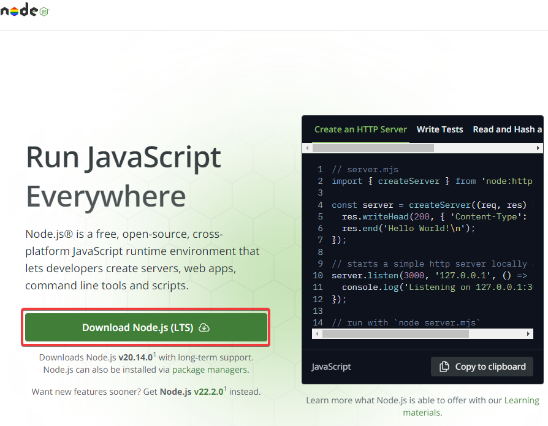

# Автотесты для страницы регистрации на Koshelek.ru

Проект содержит автоматизированные тесты на [Playwright](https://playwright.dev/) с использованием JavaScript для проверки негативных сценариев на странице регистрации [Koshelek.ru](https://koshelek.ru/). Тесты охватывают проверки валидации различных полей.

## Основные тест-кейсы
  - **Имя пользователя**: Проверка на недопустимые символы, нарушение минимальной/максимальной длины, начало имени не с буквы.
  - **Email**: Неверные форматы email, отсутствие домена и т.д.
  - **Пароль**: Нарушение минимальной/максимальной длины, отсутствие заглавных букв или чисел.

## Требования

- Node.js (v14 или выше)
- npm (v6 или выше)
- playwright

## Установка зависимостей:

Необходимо перейти по [ссылке](https://nodejs.org/en) и скачать установщик Node.js

  

После завершения процесса установки необходимо удостовериться в том, что Node.js был установлен. Для этого необходимо:

Открыть терминал Windows (cmd или powershell) и выполните следующие команды:
```bash
node -v
npm -v
```
Playwright устанавливается, как npm пакет через терминал. Для его установки необходимо выполнить следующий алгоритм:

- Ввести команду:
```bash
npm init playwright@latest 
```
- Выбрать JavaScript, как ЯП для автотестов


- Ввести имя (путь) каталога, в котором будут храниться Е2Е тесты


- Отказаться от создания файла с "github actions"


- Согласиться на установку браузеров


- По завершению распаковки и установки пакета будет выведено сообщение с перечислением терминальных команд доступных в директории проекта и о том, что были созданы примеры тестов и конфигурация PW


## Установка и запуск проекта

Склонируюте репозиторий:
```bash
git clone https://github.com/KKopilka/AQA-koshelek.git
```
Перейдите в директорию проекта:
```bash
cd AQA-koshelek
```
Для запуска тестов выполните команду:
```bash
npx playwright test
```
Запуск тестов из режима UI:
```bash
npx playwright test --ui
```

## Устранение неполадок
Убедитесь, что все зависимости установлены, а Node.js установлен корректно. В случае сбоев тестов из-за проблем с подключением или тайм-аутами, увеличьте время ожидания в **playwright.config.js**.